# Kyndryl AR Games – User Guide

*[Magyar változat / Hungarian version](USER_GUIDE_HU.md)*

Three motion-controlled mini-games for the webcam. Players control everything with their **hands**; no controller or special hardware is needed. A helper (operator) can also use the **mouse** and **keyboard** at any time, for example when young children play and an adult manages the menu and the name entry.

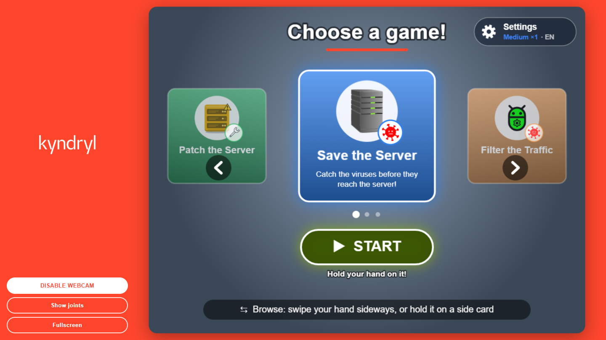

---

## Contents

1. [Before you start (operator)](#1-before-you-start-operator)
2. [Where the player should stand](#2-where-the-player-should-stand)
3. [Controls: hands, mouse, keyboard](#3-controls-hands-mouse-keyboard)
4. [The menu](#4-the-menu)
5. [Settings: language and difficulty](#5-settings-language-and-difficulty)
6. [How a round goes](#6-how-a-round-goes)
7. [The games](#7-the-games)
   - [Save the Server](#save-the-server)
   - [Filter the Traffic](#filter-the-traffic)
   - [Patch the Server](#patch-the-server)
8. [Power-ups and collectibles](#8-power-ups-and-collectibles)
9. [Name entry and leaderboard](#9-name-entry-and-leaderboard)
10. [Tips and troubleshooting](#10-tips-and-troubleshooting)
11. [Quick reference](#11-quick-reference)

---

## 1. Before you start (operator)

**You need:** a computer with a webcam, an **internet connection** (the pose-tracking model loads from the internet when the app starts) and an up-to-date Chrome or Edge browser. A large screen or projector is ideal.

1. Open the app in the browser. The page is dim until the pose tracker has loaded (a few seconds).
2. Click **ENABLE WEBCAM** in the left column and allow camera access. After about a second the game menu appears on the right.
3. Click **Fullscreen** for the biggest picture. (Press Esc or click *Exit fullscreen* to leave.)
4. Optional: **Show joints** draws the tracked body points on the video. The **big green dots** are the points the games use as the player's hands. This is handy for checking that tracking works; click *Hide joints* to turn it off.

The buttons in the left column follow the language chosen in the settings.

---

## 2. Where the player should stand

- Stand about **1.5–2.5 m** from the camera, so the **upper body, both arms and hands** are in the picture.
- Good, even lighting helps; avoid a bright window behind the player.
- **One player at a time.** Other people should stay out of the picture.
- The hand position is worked out from the **forearm** (elbow → wrist). It works with an open palm, a fist, a "blade" (hand edge-on) or a pointing hand. Players don't need to show their palm.
- The picture is mirrored like a mirror: if you move your right hand, the hand on the right side of the screen moves.

---

## 3. Controls: hands, mouse, keyboard

### With the hands (players)

Each hand shows up as a **round cursor**. Everything is done with two simple moves:

| Action | How |
|---|---|
| **Hold** (press a button) | Keep a hand on a button until its bar or ring fills up. Moving away before it fills cancels it, so a hand passing over does nothing. |
| **Swipe** (browse the menu) | Move a hand quickly sideways at card height. |

To avoid accidents, a hand that is **already resting on a button when a new screen opens** does nothing until it moves a little (its cursor looks faded meanwhile).

### With the mouse or touch screen (operator)

**Click** or tap any button. In the menu: the side cards (browse), the START button and the Settings button. On the settings screen: any option. On the name keyboard: any key. On the leaderboard: *Continue*. A click acts immediately, with no holding.

### With the keyboard (operator)

| Screen | Key | What it does |
|---|---|---|
| Menu | ← / → | Browse the games |
| Menu | Enter | Start the selected game |
| Menu | S | Open / close the settings |
| Settings | Esc, Enter or S | Close the settings |
| Name entry | letters, digits, Space, Backspace | Type the name |
| Name entry | Enter | Save the name |
| Leaderboard | Enter | Back to the menu |

**Typical kids' setup:** children play with their hands, and the helper starts games and types the names with the mouse and keyboard. Both work at the same time; there is nothing to switch.

---

## 4. The menu

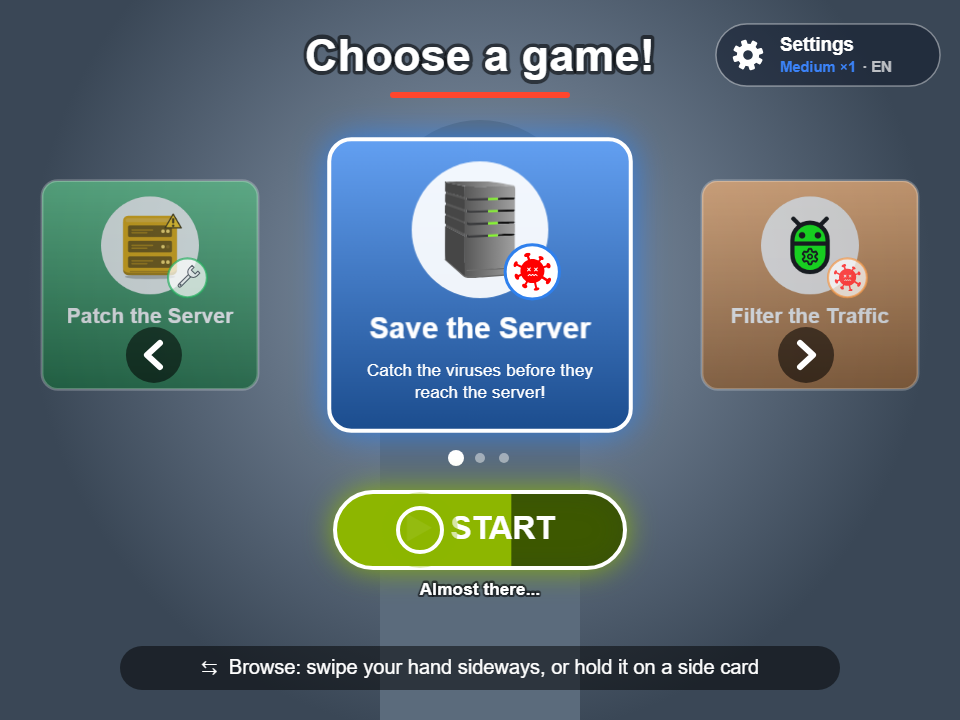

- The **center card** is the selected game. The side cards show the previous and next game; the carousel loops.
- **Browse:** swipe a hand sideways, or hold a hand on a side card (about 1 second; its arrow ring fills).
- **Start:** hold a hand on the green **START** button (about 1.5 seconds, the button fills up from the left; *"Almost there..."*).
- **Settings:** hold a hand on the **Settings** button in the top-right corner (about 1 second; the gear spins faster and a ring fills). The button also shows the current difficulty, score multiplier and language.
- The bar at the bottom cycles through short hints.

---

## 5. Settings: language and difficulty

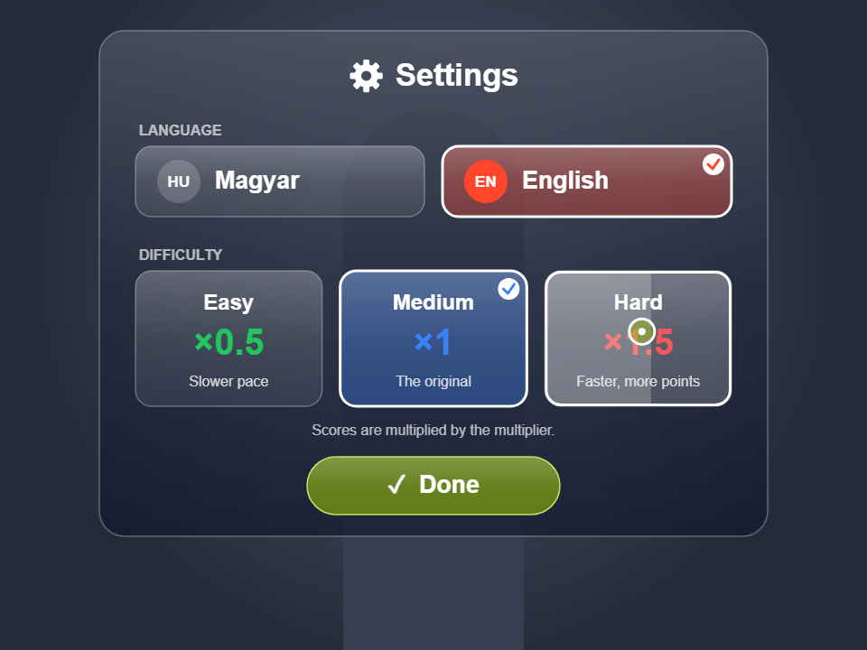

Open it with the gear button (hand hold, click, or **S**). Choose an option by holding a hand on it (about 1 second) or clicking it. **Done** closes the screen. The choices are remembered by the browser, even after a restart.

### Language

**Magyar** or **English**. All text changes, including the buttons in the left column. The **game names stay the same** in both languages.

### Difficulty

| Difficulty | What changes | Score multiplier |
|---|---|---|
| **Easy** | slower pace, fewer threats, bigger bonuses | **×0.5** |
| **Medium** | the original balance | **×1** |
| **Hard** | faster pace, more threats, smaller bonuses | **×1.5** |

- **Points are multiplied** by the difficulty's multiplier, so harder games earn more points.
- Each game has **one leaderboard for all difficulties**; every entry shows a colored tag with the difficulty it was played on.
- The difficulty is shown before every game (see the countdown) and in the menu's Settings button.

---

## 6. How a round goes

1. **Start** a game from the menu.
2. **Countdown:** a big 3‑2‑1 with *"Get ready!"* and the current difficulty. Use it to get into position.

   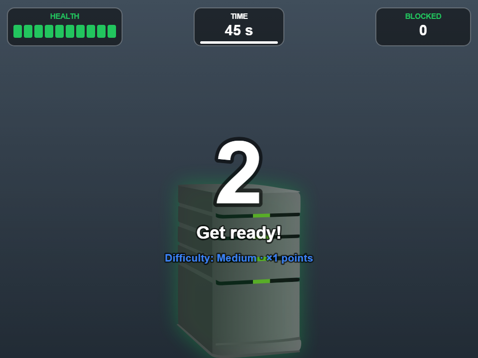

3. **Play** with your hands. The top bar (HUD) shows the important numbers: time, health, points and so on.
4. **Game over:** the results appear together with an on-screen keyboard for the player's name.
5. **Leaderboard:** the top 10, then back to the menu.

---

## 7. The games

### Save the Server

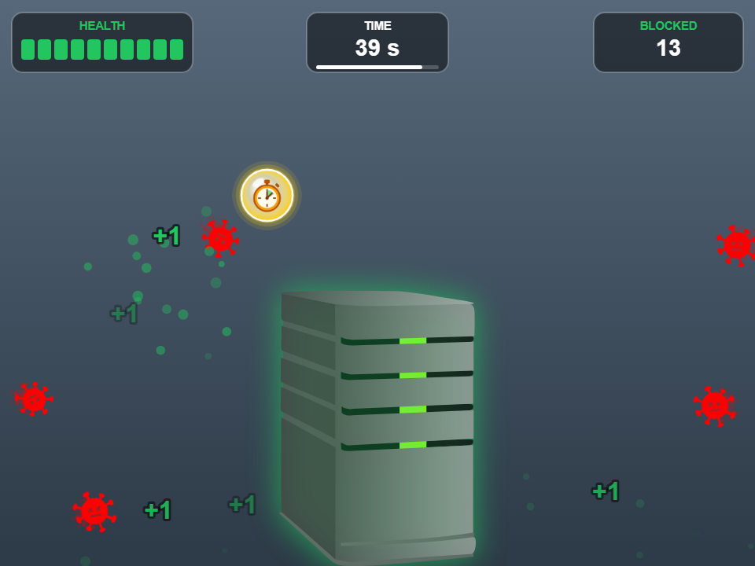

**Goal:** protect the server in the middle from viruses.

- Viruses fly in from the edges of the screen toward the server. **Touch a virus with your hand** to block it (**BLOCKED** +1).
- Every virus that reaches the server costs **1 health**. The server's glow shows its state: green, then yellow, then red.
- **Time:** 45 seconds, extendable with the stopwatch.
- **The game ends** when the time runs out or the server's health reaches 0.
- **HUD:** HEALTH (10 segments), TIME, BLOCKED.

**Collectibles:** the **stopwatch** (extra time) and the **repair kit** (extra health). See [section 8](#8-power-ups-and-collectibles).

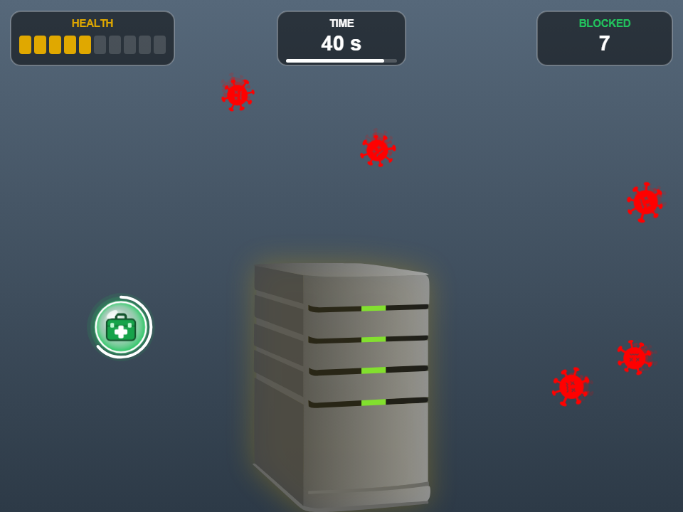

**Score:** `(health left + 1) × viruses blocked × 10 × multiplier`

*Example on Medium: 7 health left and 23 blocked → (7 + 1) × 23 × 10 × 1 = 1,840 points.* Blocking a lot **and** keeping the server healthy both count.

| | Easy | Medium | Hard |
|---|---|---|---|
| Viruses on screen at once | 4 | 5 | 6 |
| Virus speed | slow | normal | fast |
| Stopwatch bonus | +7 s | +5 s | +4 s |
| Repair kit | +3 health, max 3 per game | +2 health, max 2 | +2 health, max 1 |

---

### Filter the Traffic

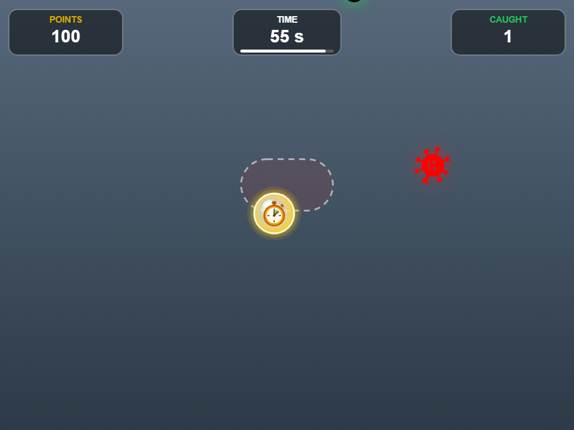

**Goal:** catch the good packages and keep the viruses away from your body.

- Green **packages** fall from the top. **Touch them with your hand** to catch them: **+100 points** (× multiplier).
- Red **viruses** fall too. The dashed zone around your **shoulders** is your body. A virus that falls into it costs **−200 points** (× multiplier). Dodge it by moving sideways; touching a virus with your hand does nothing.
- Missed packages cost nothing.
- **Time:** 60 seconds, extendable with the stopwatch.
- It gets busier over time: a second package and a second virus join during the game.
- **HUD:** POINTS, TIME, CAUGHT.

**Collectible:** a falling **stopwatch** for extra time.

**Score:** `packages caught × 100 − virus hits × 200`, all multiplied by the difficulty multiplier. On Easy a package is worth +50 and a hit −100; on Hard +150 and −300. The score can go below zero.

| | Easy | Medium | Hard |
|---|---|---|---|
| Falling speed | slower | normal | faster |
| 2nd package joins at | 20 s | 20 s | 15 s |
| 2nd virus joins at | 40 s | 30 s | 20 s |
| Stopwatch bonus | +7 s | +5 s | +4 s |

---

### Patch the Server

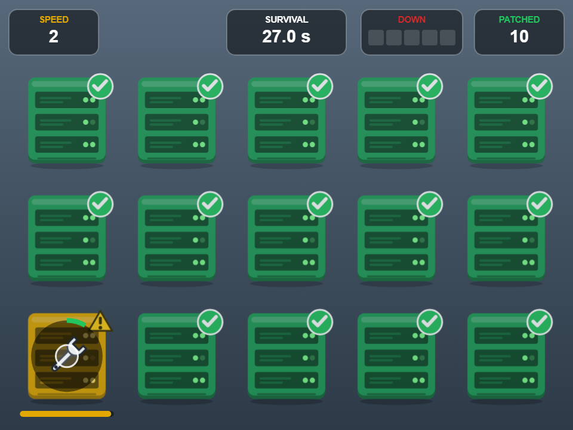

**Goal:** keep the server room alive as long as you can. It's a whack-a-mole style game.

- 15 servers, all **green** (healthy) at the start.
- From time to time a random server gets an **outdated** operating system: it turns **yellow** ⚠, and if nobody helps, **red**. The bar under it shows how much time is left.
- **Hold your hand on a yellow or red server** until the ring fills (about 1.5 seconds) to **patch** it back to green (**PATCHED** +1). Moving your hand away resets the ring.
- A server left red too long turns **black**. It is lost for good (**DOWN**).
- **The game ends when 5 servers are black.** There is no time limit.
- **It speeds up:** every 20 seconds the yellow and red phases get shorter and servers go outdated more often. The HUD's **SPEED** shows the level.
- **HUD:** SPEED (or FROZEN during a Freeze), SURVIVAL time, DOWN (5 segments), PATCHED.

**Power-ups:** **Freeze** and **Hotfix**. They only appear once the game has sped up (see [section 8](#8-power-ups-and-collectibles)).

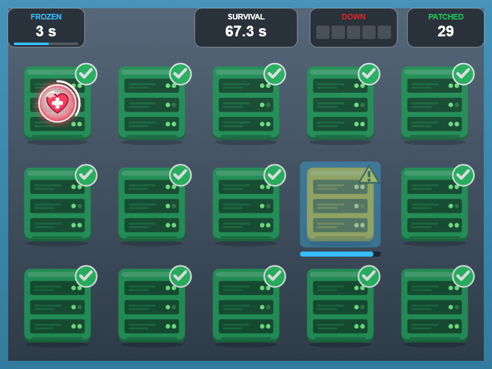

**Score:** `survived seconds × multiplier`, rounded. For example 150 seconds on Hard = 225 points.

| | Easy | Medium | Hard |
|---|---|---|---|
| Yellow and red phase at the start | 6.5 s + 6.5 s | 5 s + 5 s | 4 s + 4 s |
| Hold needed to patch | 1.2 s | 1.5 s | 1.7 s |
| New outdated server every | 3 s | 2.5 s | 2.1 s |
| Freeze length | 6 s | 5 s | 4 s |

*A typical player survives about 2 minutes on Medium, and a skilled two-handed player about 4.*

---

## 8. Power-ups and collectibles

Power-ups are **glowing bubbles** with a picture. **Touch one with your hand** to collect it. Waiting bubbles have a **white ring that runs down** and they **blink** just before they disappear. Only one is on screen at a time.

| Pickup | Game | When it appears | Effect |
|---|---|---|---|
| ⏱ **Stopwatch** (gold) | Save the Server | flies across the upper half every 12–16 s | **+5 s** of game time (Easy +7, Hard +4); the TIME box flashes gold |
| ⏱ **Stopwatch** (gold) | Filter the Traffic | falls from the top every 12–18 s | **+5 s** of game time (Easy +7, Hard +4) |
| 🧰 **Repair kit** (green) | Save the Server | beside the server once it has lost 2+ health, sooner the more damaged it is; stays 5 s | **+2 health** (Easy +3); at most 3 / 2 / 1 per game on Easy / Medium / Hard |
| ❄ **Freeze** (blue) | Patch the Server | over a healthy server when 3+ servers need help; stays 5 s | every yellow/red countdown **stops** for 5 s (Easy 6, Hard 4); the screen gets a frosty blue frame and the HUD shows FROZEN |
| ♥ **Hotfix** (red heart) | Patch the Server | over a healthy server when a server is down; stays 5 s | the **last lost server comes back** (DOWN −1); at most 2 per game |

**About Patch the Server:** no power-ups appear in the calm first 40 seconds. After that they come more often as the game speeds up: about every 30 s at first, down to every 14 s. They make a good run longer, but the game never becomes endless. The clock and the speed-up keep running even during a Freeze.

---

## 9. Name entry and leaderboard

### Entering the name

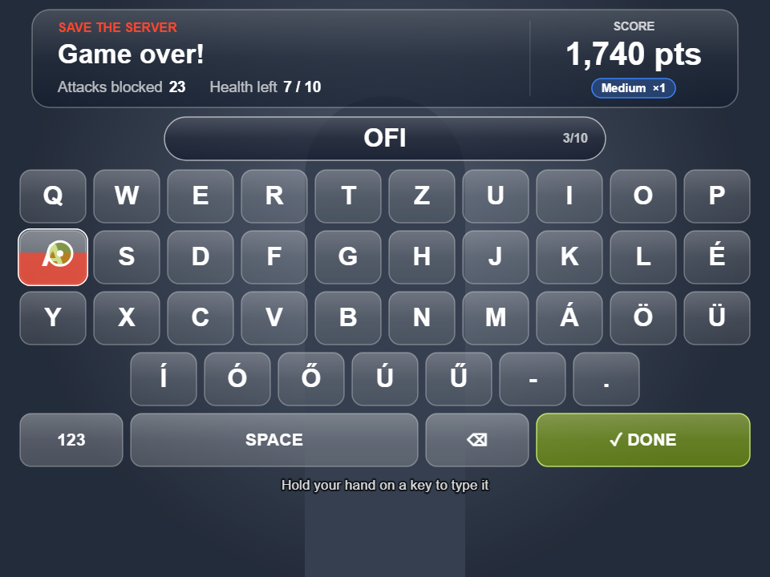

At the end of the game the results appear at the top: the game name, the stats, the **final score** (it counts up) and the difficulty. Below them is an **on-screen keyboard**.

- **With the hands:** hold a hand on a key until it fills from the bottom (about 0.8 s) to type it. Keep holding to repeat the letter after a short pause.
- **With the mouse or touch:** click the keys.
- **With a real keyboard:** just type, and press Enter to save.
- Up to **10 characters**. Names are in capitals. Hungarian accented letters are in the 4th row.
- **123** switches the 4th row to digits (and **ÁÉŐ** switches back). **SPACE** adds a space and **⌫** deletes the last character.
- **✓ DONE** saves the name. It needs a longer hold (about 1.4 s) so nobody saves by accident.
- If the name is left empty, the result is saved as **ANONYMOUS**.
- If nobody types anything for **45 seconds**, the result is saved automatically with whatever has been typed, so the station never gets stuck.

### Leaderboard

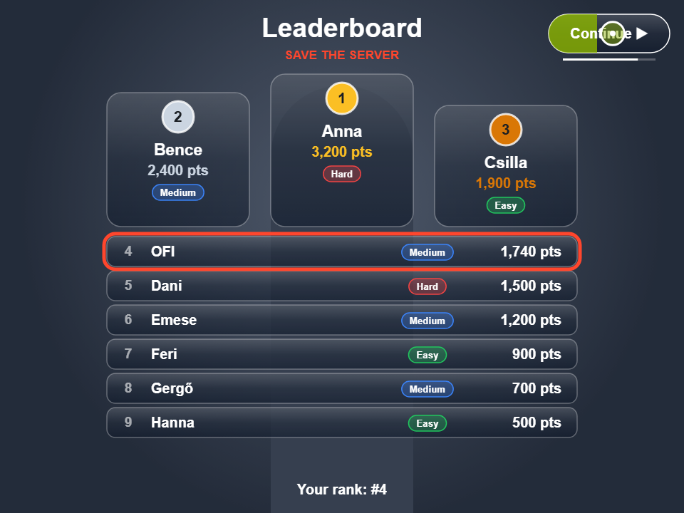

- Each game has its own **top 10**. The top three stand on a **podium** with gold, silver and bronze medals.
- Every entry shows the name, the score and a **difficulty tag** (Easy / Medium / Hard).
- The new result is **outlined in orange**. A new first place gets a **"NEW RECORD!"** badge, and a top-3 place gets confetti.
- If the result didn't make the top 10, the bottom line shows the score anyway.
- **Continue ▶** (top right): hold a hand on it for 1 s, click it, or press Enter to go back to the menu. It also goes back by itself after 10 seconds; the thin bar under the button shows the time left.

The leaderboards are **stored in this browser on this computer**. They survive a restart, but they are not shared between computers or browsers.

---

## 10. Tips and troubleshooting

| Problem | What to do |
|---|---|
| The page stays dim and nothing happens | The pose tracker is still loading, or there is no internet. Check the connection and reload the page. |
| The camera doesn't start | Allow camera access in the browser (camera icon in the address bar). Close other apps that use the camera. |
| The hand cursors don't appear or jump around | Improve the lighting and step back so both arms fit in the picture. Make sure only one person is visible. Turn on **Show joints** to check the green hand dots. |
| A hand on a button does nothing | That hand was resting there when the screen opened. Move it a little and try again. |
| The games run slowly | Close other programs and browser tabs. The app falls back to the processor automatically if the graphics card can't be used; that works, but it is slower. |
| Resetting the leaderboards | Press F12 → *Application* → *Local Storage* → the site's address, and delete the keys `saveTheServerLeaderboard`, `filterTheTrafficLeaderboard` and `patchTheServerLeaderboard`. (`arGameSettings` holds the language and difficulty.) |

**Operator tips**

- For young children, **Easy** gives a slower pace. The ×0.5 multiplier keeps the shared leaderboard fair.
- Show the player where the **dashed shoulder zone** is in Filter the Traffic before the round starts; the countdown is a good moment.
- In Patch the Server, remind players that they **can use both hands**, one on each server.

---

## 11. Quick reference

| | Save the Server | Filter the Traffic | Patch the Server |
|---|---|---|---|
| **Goal** | Block the viruses | Catch packages, dodge viruses | Patch yellow/red servers |
| **How** | Touch viruses | Touch packages, keep viruses off your shoulders | Hold your hand on a server |
| **Length** | 45 s (+ stopwatches) | 60 s (+ stopwatches) | Until 5 servers are down |
| **Score** | (health + 1) × blocked × 10 | +100 per package, −200 per virus hit | 1 point per second survived |
| **Pickups** | Stopwatch, repair kit | Stopwatch | Freeze, Hotfix |
| **Multiplier** | Easy ×0.5 · Medium ×1 · Hard ×1.5 | same | same |
