# Kyndryl AR játékok – Felhasználói útmutató

*[English version / Angol változat](USER_GUIDE_EN.md)*

Három mozgással irányítható minijáték webkamerához. A játékosok mindent a **kezükkel** irányítanak, nincs szükség kontrollerre vagy különleges eszközre. Egy segítő (operátor) bármikor használhatja az **egeret** és a **billentyűzetet** is, például ha kisgyerekek játszanak, és egy felnőtt kezeli a menüt és a névbeírást.

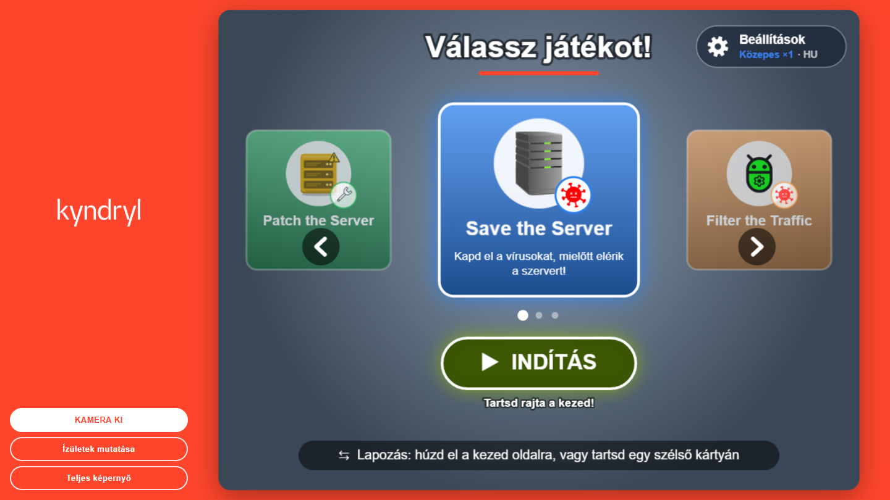

---

## Tartalom

1. [Indítás előtt (operátor)](#1-indítás-előtt-operátor)
2. [Hol álljon a játékos?](#2-hol-álljon-a-játékos)
3. [Irányítás: kéz, egér, billentyűzet](#3-irányítás-kéz-egér-billentyűzet)
4. [A menü](#4-a-menü)
5. [Beállítások: nyelv és nehézség](#5-beállítások-nyelv-és-nehézség)
6. [Egy kör menete](#6-egy-kör-menete)
7. [A játékok](#7-a-játékok)
   - [Save the Server](#save-the-server)
   - [Filter the Traffic](#filter-the-traffic)
   - [Patch the Server](#patch-the-server)
8. [Bónuszok és gyűjthető tárgyak](#8-bónuszok-és-gyűjthető-tárgyak)
9. [Névbeírás és ranglista](#9-névbeírás-és-ranglista)
10. [Tippek és hibaelhárítás](#10-tippek-és-hibaelhárítás)
11. [Gyors összefoglaló](#11-gyors-összefoglaló)

---

## 1. Indítás előtt (operátor)

**Szükséges:** webkamerás számítógép, **internetkapcsolat** (a testkövető modell induláskor az internetről töltődik be) és friss Chrome vagy Edge böngésző. Ideális egy nagy képernyő vagy projektor.

1. Nyisd meg az alkalmazást a böngészőben. Az oldal halvány, amíg a testkövető be nem töltődik (néhány másodperc).
2. Kattints a bal oldali oszlopban a **KAMERA BE** gombra, és engedélyezd a kamerát. Kb. egy másodperc múlva jobb oldalt megjelenik a játékmenü.
3. A **Teljes képernyő** gombbal kapod a legnagyobb képet. (Kilépés: Esc vagy *Kilépés a teljes képernyőből*.)
4. Opcionális: az **Ízületek mutatása** a követett testpontokat rajzolja a videóra. A **nagy zöld pöttyök** azok a pontok, amelyeket a játékok a játékos kezeként használnak. Jól jön annak ellenőrzésére, hogy működik-e a követés; kikapcsolás: *Ízületek elrejtése*.

A bal oldali gombok a beállításokban választott nyelvet követik.

---

## 2. Hol álljon a játékos?

- Kb. **1,5–2,5 méterre** a kamerától, hogy a **felsőtest, mindkét kar és kéz** látsszon a képen.
- Segít a jó, egyenletes világítás; kerüld, hogy a játékos mögött erős fényű ablak legyen.
- **Egyszerre egy játékos.** Mások ne álljanak be a képbe.
- A kéz helyét az **alkarból** (könyök → csukló) számolja a program. Működik nyitott tenyérrel, ököllel, élével tartott kézzel vagy mutató kézzel is. Nem kell a tenyeret mutatni.
- A kép tükrözött, mint egy tükör: ha a jobb kezedet mozdítod, a képernyő jobb oldalán lévő kéz mozdul.

---

## 3. Irányítás: kéz, egér, billentyűzet

### Kézzel (játékosok)

Mindkét kéz egy **kerek kurzorként** jelenik meg. Minden két egyszerű mozdulattal megy:

| Művelet | Hogyan? |
|---|---|
| **Tartás** (gomb megnyomása) | Tartsd a kezed a gombon, amíg a sávja vagy gyűrűje megtelik. Ha előtte elveszed, a művelet elmarad, így egy átsuhanó kéz nem nyom meg semmit. |
| **Húzás** (lapozás a menüben) | Húzd el gyorsan oldalra a kezed a kártyák magasságában. |

Hogy ne legyen véletlen megnyomás: az a kéz, amelyik **már egy gombon pihent, amikor új képernyő nyílt**, addig nem nyom meg semmit, amíg egy kicsit meg nem mozdul (addig a kurzora halványabb).

### Egérrel vagy érintőképernyővel (operátor)

**Kattints** vagy koppints bármelyik gombra. A menüben: az oldalsó kártyák (lapozás), az INDÍTÁS gomb és a Beállítások gomb. A beállításoknál: bármelyik lehetőség. A névbeíró billentyűzeten: bármelyik billentyű. A ranglistán: *Tovább*. A kattintás azonnal hat, nem kell tartani.

### Billentyűzettel (operátor)

| Képernyő | Billentyű | Mit csinál? |
|---|---|---|
| Menü | ← / → | Lapozás a játékok között |
| Menü | Enter | A kiválasztott játék indítása |
| Menü | S | Beállítások megnyitása / bezárása |
| Beállítások | Esc, Enter vagy S | Beállítások bezárása |
| Névbeírás | betűk, számok, szóköz, Backspace | A név begépelése |
| Névbeírás | Enter | A név mentése |
| Ranglista | Enter | Vissza a menübe |

**Tipikus beállítás gyerekeknél:** a gyerekek kézzel játszanak, a segítő pedig egérrel és billentyűzettel indítja a játékokat és írja be a neveket. A kettő egyszerre működik, nem kell semmit átkapcsolni.

---

## 4. A menü

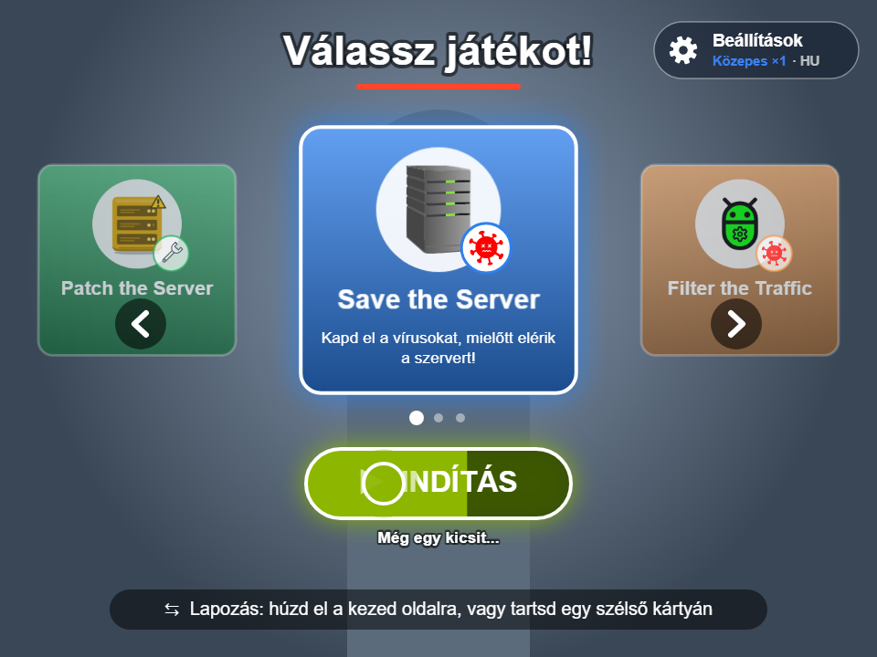

- A **középső kártya** a kiválasztott játék. Az oldalsó kártyák az előző és a következő játékot mutatják; a körhinta körbeér.
- **Lapozás:** húzd el oldalra a kezed, vagy tartsd egy oldalsó kártyán (kb. 1 másodperc, megtelik a nyíl gyűrűje).
- **Indítás:** tartsd a kezed a zöld **INDÍTÁS** gombon (kb. 1,5 másodperc, balról megtelik a gomb; *„Még egy kicsit...”*).
- **Beállítások:** tartsd a kezed a jobb felső sarokban lévő **Beállítások** gombon (kb. 1 másodperc; a fogaskerék gyorsabban forog, és megtelik egy gyűrű). A gomb az aktuális nehézséget, a pontszorzót és a nyelvet is mutatja.
- Az alsó sávban rövid tippek váltakoznak.

---

## 5. Beállítások: nyelv és nehézség

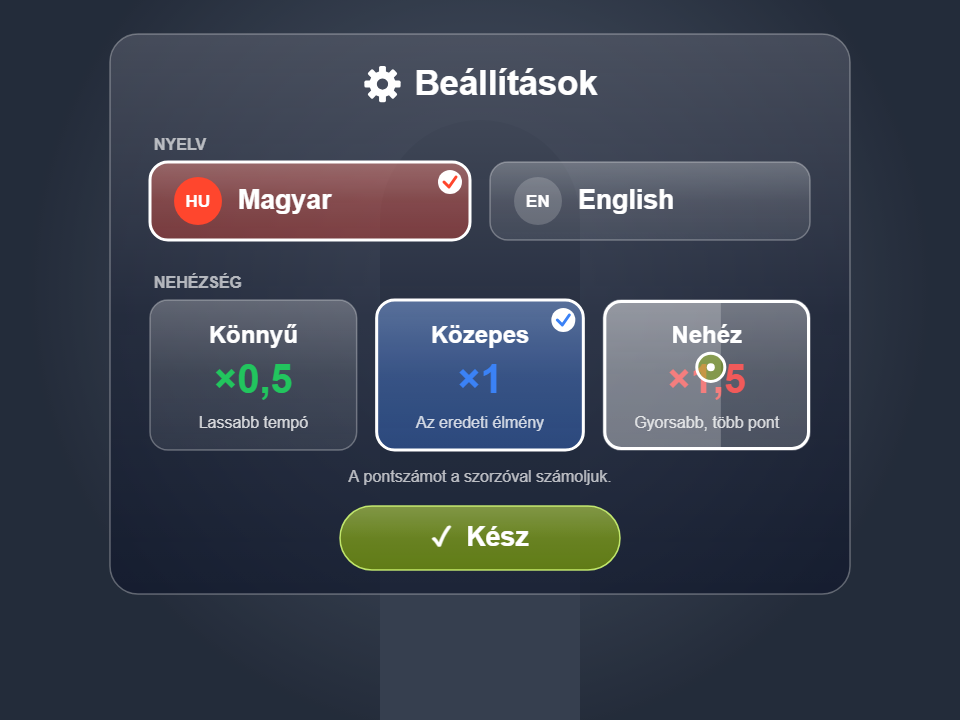

A fogaskerék gombbal nyílik meg (kéztartással, kattintással vagy az **S** billentyűvel). Egy lehetőséget úgy választasz ki, hogy rajta tartod a kezed (kb. 1 másodperc), vagy rákattintasz. A **Kész** bezárja a képernyőt. A böngésző megjegyzi a választást, újraindítás után is.

### Nyelv

**Magyar** vagy **English**. Minden felirat átvált, a bal oldali gombok is. A **játékok neve mindkét nyelven ugyanaz marad**.

### Nehézség

| Nehézség | Mi változik? | Pontszorzó |
|---|---|---|
| **Könnyű** | lassabb tempó, kevesebb veszély, nagyobb bónuszok | **×0,5** |
| **Közepes** | az eredeti egyensúly | **×1** |
| **Nehéz** | gyorsabb tempó, több veszély, kisebb bónuszok | **×1,5** |

- A **pontokat megszorozzuk** a nehézség szorzójával, így a nehezebb játék több pontot ér.
- Minden játéknak **egy közös ranglistája van az összes nehézségre**; minden bejegyzés mellett színes címke mutatja, milyen nehézségen játszották.
- A nehézség minden játék előtt látszik (a visszaszámlálásnál), és a menü Beállítások gombján is.

---

## 6. Egy kör menete

1. **Indítsd** a játékot a menüből.
2. **Visszaszámlálás:** nagy 3‑2‑1 a *„Készülj!”* felirattal és az aktuális nehézséggel. Ez alatt lehet beállni a helyedre.

   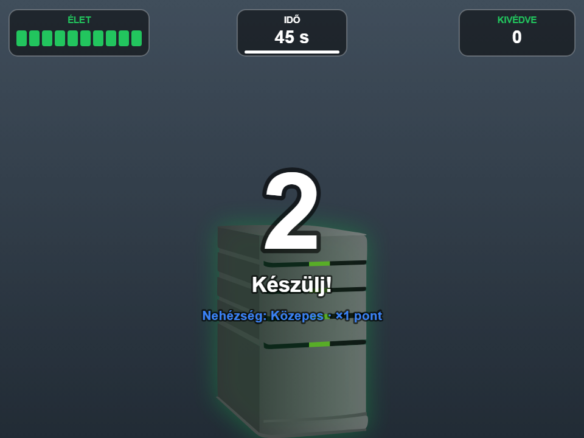

3. **Játék** a kezeddel. A felső sáv (HUD) a fontos számokat mutatja: időt, életet, pontot stb.
4. **Vége a játéknak:** megjelenik az eredmény és egy képernyő-billentyűzet a játékos nevéhez.
5. **Ranglista:** a legjobb 10, aztán vissza a menübe.

---

## 7. A játékok

### Save the Server

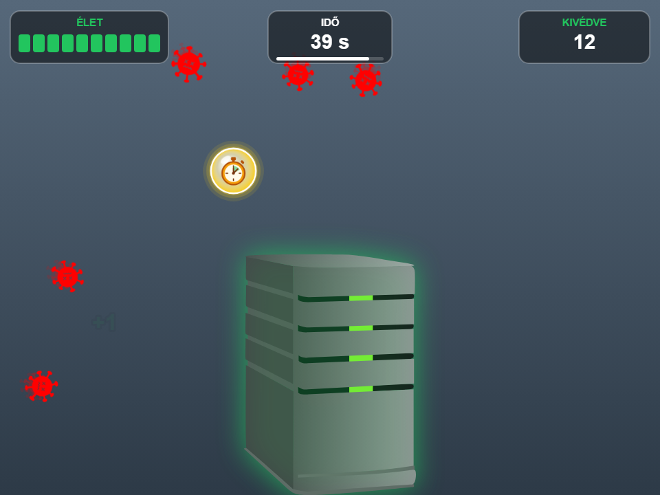

**Cél:** védd meg a középen álló szervert a vírusoktól.

- A vírusok a képernyő széleiről repülnek a szerver felé. **Érintsd meg a vírust a kezeddel**, és kivédted (**KIVÉDVE** +1).
- Minden vírus, amely eléri a szervert, **1 életbe** kerül. A szerver fénye mutatja az állapotát: zöld, aztán sárga, aztán piros.
- **Idő:** 45 másodperc, a stopperrel meghosszabbítható.
- **A játék véget ér**, ha lejár az idő, vagy a szerver élete 0-ra csökken.
- **HUD:** ÉLET (10 szegmens), IDŐ, KIVÉDVE.

**Gyűjthető tárgyak:** a **stopper** (plusz idő) és a **javítókészlet** (plusz élet). Lásd a [8. fejezetet](#8-bónuszok-és-gyűjthető-tárgyak).

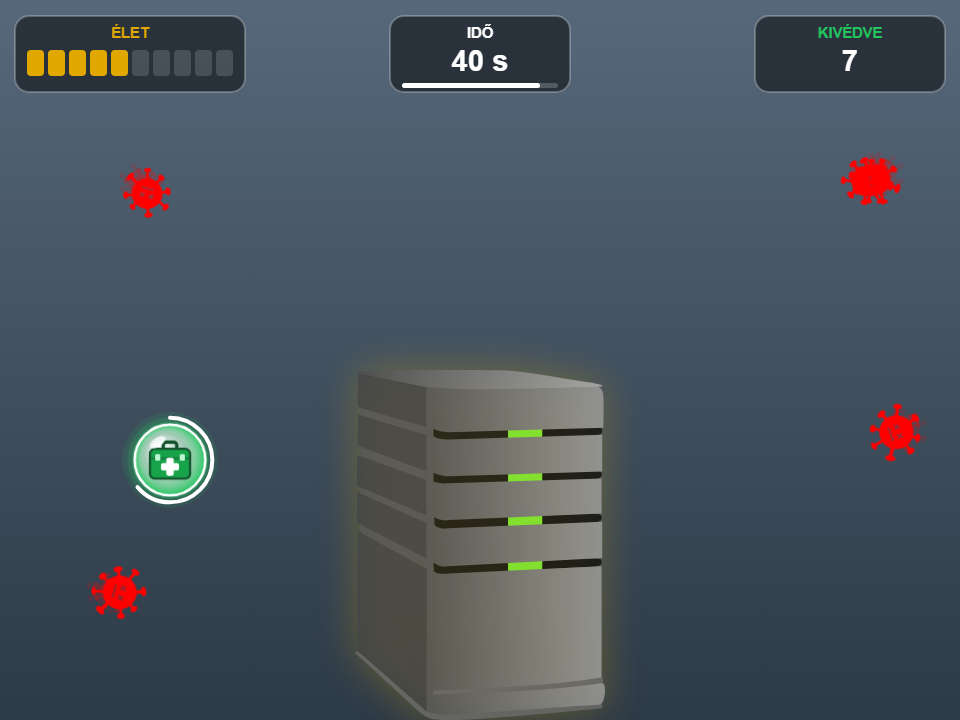

**Pontszám:** `(megmaradt élet + 1) × kivédett vírusok × 10 × szorzó`

*Példa közepes nehézségen: 7 megmaradt élet és 23 kivédett vírus → (7 + 1) × 23 × 10 × 1 = 1840 pont.* A sok kivédés **és** az egészséges szerver is számít.

| | Könnyű | Közepes | Nehéz |
|---|---|---|---|
| Egyszerre a képen lévő vírusok | 4 | 5 | 6 |
| A vírusok sebessége | lassú | normál | gyors |
| Stopper bónusz | +7 mp | +5 mp | +4 mp |
| Javítókészlet | +3 élet, legfeljebb 3 játékonként | +2 élet, legfeljebb 2 | +2 élet, legfeljebb 1 |

---

### Filter the Traffic

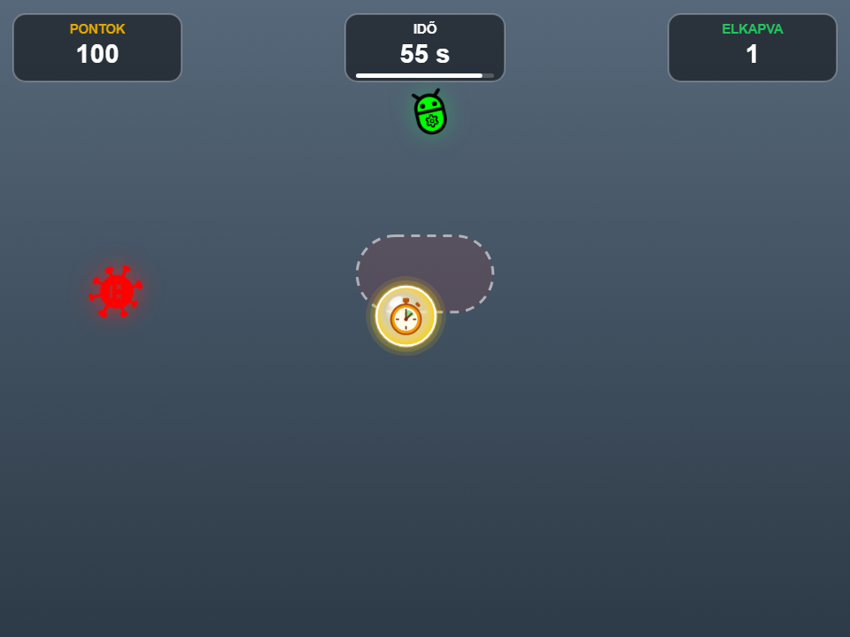

**Cél:** kapd el a jó csomagokat, a vírusokat pedig tartsd távol a testedtől.

- Fentről zöld **csomagok** esnek. **Érintsd meg őket a kezeddel**, és elkaptad: **+100 pont** (× szorzó).
- Piros **vírusok** is esnek. A **vállad** körüli szaggatott vonalú terület a tested. Ha egy vírus beleesik, az **−200 pont** (× szorzó). Oldalra lépve kerülheted ki; ha a kezeddel érsz egy vírushoz, az nem számít semmit.
- A leejtett csomagokért nem jár pontlevonás.
- **Idő:** 60 másodperc, a stopperrel meghosszabbítható.
- Idővel egyre sűrűbb: játék közben egy második csomag és egy második vírus is beszáll.
- **HUD:** PONTOK, IDŐ, ELKAPVA.

**Gyűjthető tárgy:** egy leeső **stopper** plusz időért.

**Pontszám:** `elkapott csomagok × 100 − vírustalálatok × 200`, az egészet szorozva a nehézség szorzójával. Könnyű fokozaton egy csomag +50, egy találat −100; nehéz fokozaton +150 és −300. A pontszám nulla alá is mehet.

| | Könnyű | Közepes | Nehéz |
|---|---|---|---|
| Esési sebesség | lassabb | normál | gyorsabb |
| A 2. csomag érkezése | 20 mp | 20 mp | 15 mp |
| A 2. vírus érkezése | 40 mp | 30 mp | 20 mp |
| Stopper bónusz | +7 mp | +5 mp | +4 mp |

---

### Patch the Server

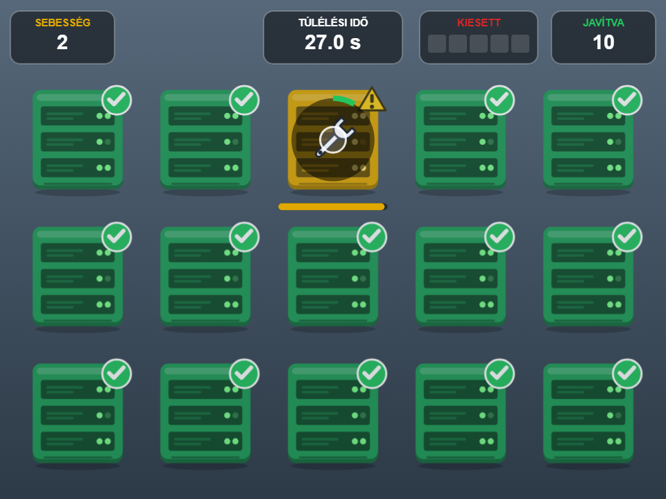

**Cél:** tartsd életben a szervertermet, ameddig csak tudod. Vakondüldözős (whack-a-mole) típusú játék.

- 15 szerver, induláskor mind **zöld** (egészséges).
- Időnként egy véletlenszerű szerver operációs rendszere **elavul**: **sárga** lesz ⚠, és ha senki nem segít, **piros**. Az alatta lévő sáv mutatja, mennyi idő van még hátra.
- **Tartsd a kezed a sárga vagy piros szerveren**, amíg a gyűrű megtelik (kb. 1,5 másodperc), és **megjavítod**: újra zöld lesz (**JAVÍTVA** +1). Ha elveszed a kezed, a gyűrű újraindul.
- Ha egy szerver túl sokáig piros marad, **fekete** lesz. Az végleg kiesett (**KIESETT**).
- **A játék akkor ér véget, amikor 5 szerver fekete.** Nincs időkorlát.
- **Gyorsul:** 20 másodpercenként rövidebb lesz a sárga és a piros szakasz, és gyakrabban avulnak el szerverek. A HUD **SEBESSÉG** mezője mutatja a szintet.
- **HUD:** SEBESSÉG (Fagyasztás alatt FAGYASZTVA), TÚLÉLÉSI IDŐ, KIESETT (5 szegmens), JAVÍTVA.

**Bónuszok:** **Fagyasztás** és **Hotfix**. Csak akkor jelennek meg, amikor a játék már felgyorsult (lásd a [8. fejezetet](#8-bónuszok-és-gyűjthető-tárgyak)).

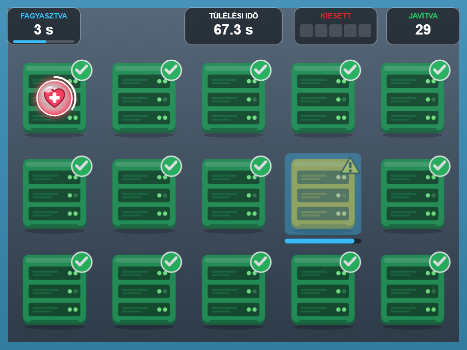

**Pontszám:** `túlélt másodpercek × szorzó`, kerekítve. Például 150 másodperc nehéz fokozaton = 225 pont.

| | Könnyű | Közepes | Nehéz |
|---|---|---|---|
| Sárga és piros szakasz az elején | 6,5 + 6,5 mp | 5 + 5 mp | 4 + 4 mp |
| Javításhoz szükséges tartás | 1,2 mp | 1,5 mp | 1,7 mp |
| Új elavult szerver ennyi időnként | 3 mp | 2,5 mp | 2,1 mp |
| A Fagyasztás hossza | 6 mp | 5 mp | 4 mp |

*Egy átlagos játékos közepes fokozaton kb. 2 percig bírja, egy ügyes, kétkezes játékos kb. 4 percig.*

---

## 8. Bónuszok és gyűjthető tárgyak

A bónuszok **világító buborékok** egy képpel. **Érintsd meg őket a kezeddel**, és felvetted őket. A várakozó buborékon egy **fogyó fehér gyűrű** látszik, és eltűnés előtt **villognak**. Egyszerre csak egy lehet a képen.

| Tárgy | Játék | Mikor jelenik meg? | Hatás |
|---|---|---|---|
| ⏱ **Stopper** (arany) | Save the Server | 12–16 másodpercenként átrepül a képernyő felső felén | **+5 mp** játékidő (könnyű +7, nehéz +4); az IDŐ mező aranyszínűen felvillan |
| ⏱ **Stopper** (arany) | Filter the Traffic | 12–18 másodpercenként leesik felülről | **+5 mp** játékidő (könnyű +7, nehéz +4) |
| 🧰 **Javítókészlet** (zöld) | Save the Server | a szerver mellett, ha az már legalább 2 életet vesztett; minél sérültebb, annál hamarabb jön; 5 mp-ig marad | **+2 élet** (könnyű +3); játékonként legfeljebb 3 / 2 / 1 (könnyű / közepes / nehéz) |
| ❄ **Fagyasztás** (kék) | Patch the Server | egy egészséges szerver fölött, ha legalább 3 szerver segítségre szorul; 5 mp-ig marad | minden sárga és piros visszaszámlálás **megáll** 5 mp-re (könnyű 6, nehéz 4); a képernyő jeges kék keretet kap, a HUD-on FAGYASZTVA látszik |
| ♥ **Hotfix** (piros szív) | Patch the Server | egy egészséges szerver fölött, ha már kiesett egy szerver; 5 mp-ig marad | a **legutóbb kiesett szerver visszatér** (KIESETT −1); játékonként legfeljebb 2 |

**A Patch the Serverről:** a nyugodt első 40 másodpercben nincs bónusz. Utána annál gyakrabban jönnek, minél gyorsabb a játék: eleinte kb. 30 másodpercenként, később akár 14 másodpercenként. Egy jó menetet meghosszabbítanak, de a játék sosem lesz végtelen. Az idő és a gyorsulás a Fagyasztás alatt is megy tovább.

---

## 9. Névbeírás és ranglista

### A név beírása

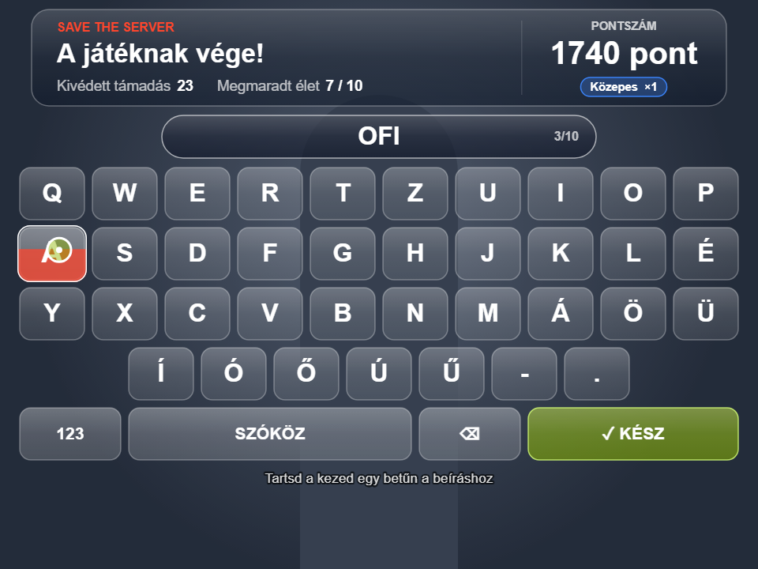

A játék végén felül megjelenik az eredmény: a játék neve, a statisztikák, a **végső pontszám** (felpörög) és a nehézség. Alatta egy **képernyő-billentyűzet** van.

- **Kézzel:** tartsd a kezed egy billentyűn, amíg alulról megtelik (kb. 0,8 mp), és beíródik a betű. Ha rajta tartod, egy kis szünet után újra beírja.
- **Egérrel vagy érintéssel:** kattints a billentyűkre.
- **Valódi billentyűzettel:** egyszerűen gépeld be, és Enterrel mentsd.
- Legfeljebb **10 karakter**. A nevek nagybetűsek. Az ékezetes magyar betűk a 4. sorban vannak.
- A **123** gomb a 4. sort számokra váltja (az **ÁÉŐ** vissza). A **SZÓKÖZ** szóközt ír, a **⌫** törli az utolsó karaktert.
- A **✓ KÉSZ** menti a nevet. Hosszabban kell tartani (kb. 1,4 mp), hogy senki ne mentsen véletlenül.
- Ha üresen marad a név, az eredmény **NÉVTELEN** néven kerül mentésre.
- Ha **45 másodpercig** senki nem ír semmit, az eredmény automatikusan mentésre kerül az addig beírt névvel, így az állomás sosem akad el.

### Ranglista

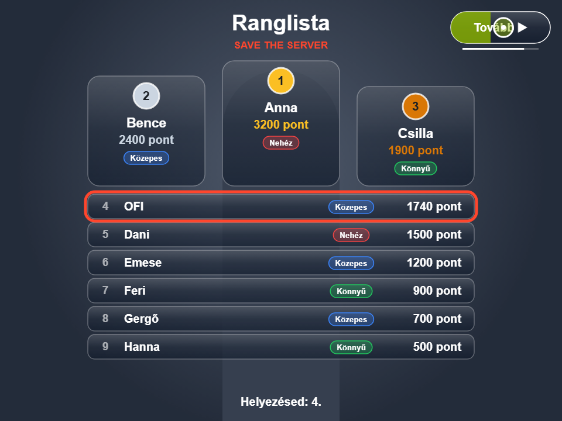

- Minden játéknak saját **top 10-es listája** van. Az első három egy **dobogón** áll arany, ezüst és bronz éremmel.
- Minden bejegyzésnél látszik a név, a pontszám és egy **nehézségi címke** (Könnyű / Közepes / Nehéz).
- Az új eredményt **narancssárga keret** jelöli. Új első helynél **„ÚJ REKORD!”** jelvény jár, dobogós helynél konfetti.
- Ha az eredmény nem fért be a legjobb 10 közé, az alsó sor akkor is kiírja a pontszámot.
- **Tovább ▶** (jobb felső sarok): tartsd rajta a kezed 1 mp-ig, kattints rá, vagy nyomj Entert, és visszajutsz a menübe. 10 másodperc után magától is visszalép; a gomb alatti vékony csík mutatja a hátralévő időt.

A ranglisták **ebben a böngészőben, ezen a gépen tárolódnak**. Újraindítás után is megmaradnak, de nem közösek más gépekkel vagy böngészőkkel.

---

## 10. Tippek és hibaelhárítás

| Probléma | Teendő |
|---|---|
| Az oldal halvány marad, és nem történik semmi | A testkövető még töltődik, vagy nincs internet. Ellenőrizd a kapcsolatot, és töltsd újra az oldalt. |
| Nem indul a kamera | Engedélyezd a kamerát a böngészőben (kamera ikon a címsorban). Zárd be a kamerát használó más programokat. |
| Nem jelennek meg a kézkurzorok, vagy ugrálnak | Javíts a világításon, és lépj hátrébb, hogy mindkét kar beférjen a képbe. Csak egy ember legyen a képen. Kapcsold be az **Ízületek mutatása** gombot, és nézd meg a zöld kézpöttyöket. |
| A kéz egy gombon van, de nem történik semmi | Az a kéz már ott pihent, amikor megnyílt a képernyő. Mozdítsd meg egy kicsit, és próbáld újra. |
| Lassan futnak a játékok | Zárd be a többi programot és böngészőlapot. Ha a videokártya nem használható, az alkalmazás magától a processzorra vált; ez működik, csak lassabb. |
| A ranglisták törlése | F12 → *Application* → *Local Storage* → az oldal címe, és töröld a `saveTheServerLeaderboard`, `filterTheTrafficLeaderboard` és `patchTheServerLeaderboard` kulcsokat. (Az `arGameSettings` tárolja a nyelvet és a nehézséget.) |

**Tippek az operátornak**

- Kisgyerekeknek a **Könnyű** fokozat lassabb tempót ad. A ×0,5-ös szorzó igazságosan tartja a közös ranglistát.
- A Filter the Traffic előtt mutasd meg a játékosnak, hol van a **vállánál a szaggatott terület**; erre jó alkalom a visszaszámlálás.
- A Patch the Servernél emlékeztesd a játékosokat, hogy **mindkét kezüket használhatják**, egyiket az egyik, másikat a másik szerveren.

---

## 11. Gyors összefoglaló

| | Save the Server | Filter the Traffic | Patch the Server |
|---|---|---|---|
| **Cél** | Védd ki a vírusokat | Kapd el a csomagokat, kerüld a vírusokat | Javítsd meg a sárga/piros szervereket |
| **Hogyan?** | Érintsd meg a vírusokat | Érintsd meg a csomagokat, tartsd távol a vírusokat a válladtól | Tartsd a kezed a szerveren |
| **Hossz** | 45 mp (+ stopperek) | 60 mp (+ stopperek) | Amíg 5 szerver ki nem esik |
| **Pontszám** | (élet + 1) × kivédett × 10 | +100 csomagonként, −200 vírustalálatonként | 1 pont túlélt másodpercenként |
| **Tárgyak** | Stopper, javítókészlet | Stopper | Fagyasztás, Hotfix |
| **Szorzó** | Könnyű ×0,5 · Közepes ×1 · Nehéz ×1,5 | ugyanaz | ugyanaz |
